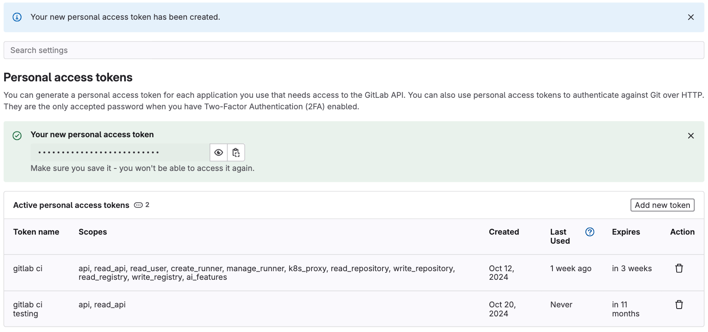
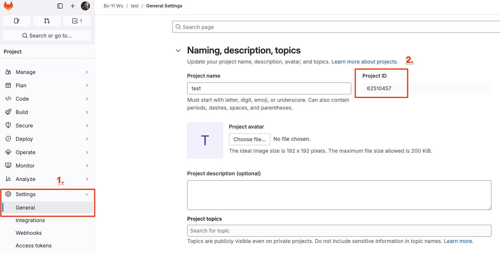

# 🚀 GitLab CI for GitHub Actions

[](https://github.com/appleboy/gitlab-ci-action/actions/workflows/ci.yml)

[GitHub Action](https://github.com/features/actions) for trigger [gitlab-ci](https://about.gitlab.com/gitlab-ci) jobs. See Trigger pipelines by [using the API](https://docs.gitlab.com/ee/ci/triggers/index.html).

## Usage

Trigger New GitLab CI Job.

```yml
name: trigger gitlab job
on: [push]
jobs:

  build:
    name: Build
    runs-on: ubuntu-latest
    steps:
    - name: trigger Job
      uses: ghcr.io/appleboy/gitlab-ci-action@v1.3.0
      with:
        host: "http://example.com"
        token: ${{ secrets.TOKEN }}
        project_id: 100

```

## GitLab Setting

See the detail documentation for [Triggering pipelines through the API](https://docs.gitlab.com/ee/ci/triggers/). Create your access token by going to your `User Settings ➔ Access Tokens` under Access Tokens.



How to get the project ID? going to your project’s `Settings ➔ General` under General project.



## Example

Specific the GitLab host URL:

```yml
- name: trigger Job
  uses: ghcr.io/appleboy/gitlab-ci-action@v1.3.0
  with:
    host: "http://example.com"
    token: ${{ secrets.TOKEN }}
    debug: true
    project_id: 100
```

Other specific `branch` or `tag` name:

```diff
  - name: trigger Job
    uses: ghcr.io/appleboy/gitlab-ci-action@v1.3.0
    with:
      host: "http://example.com"
      token: ${{ secrets.TOKEN }}
      debug: true
      project_id: 100
+     ref: v1.0.0
```

Pass the variables to the triggered pipeline:

```diff
  - name: trigger Job
    uses: ghcr.io/appleboy/gitlab-ci-action@v1.3.0
    with:
      host: "http://example.com"
      token: ${{ secrets.TOKEN }}
      debug: true
      project_id: 100
+     variables: key1=value01,key2=value02
```

Wait for pipeline to complete, default as `false`:

```diff
  - name: trigger Job
    uses: ghcr.io/appleboy/gitlab-ci-action@v1.3.0
    with:
      host: "http://example.com"
      token: ${{ secrets.TOKEN }}
      debug: true
      project_id: 100
+     wait: true
```

Timeout waiting for pipeline to complete, default as `1h`:

```diff
  - name: trigger Job
    uses: ghcr.io/appleboy/gitlab-ci-action@v1.3.0
    with:
      host: "http://example.com"
      token: ${{ secrets.TOKEN }}
      debug: true
      project_id: 100
+     wait: true
+     timeout: 60s
```

Interval waiting for pipeline to complete, default as `5s`:

```diff
  - name: trigger Job
    uses: ghcr.io/appleboy/gitlab-ci-action@v1.3.0
    with:
      host: "http://example.com"
      token: ${{ secrets.TOKEN }}
      debug: true
      project_id: 100
+     wait: true
+     interval: 10s
```

Allow insecure SSL connections, default as `false`:

```diff
  - name: trigger Job
    uses: ghcr.io/appleboy/gitlab-ci-action@v1.3.0
    with:
      host: "http://example.com"
      token: ${{ secrets.TOKEN }}
      debug: true
      project_id: 100
+     insecure: true
```

Show output status

```diff
  - name: trigger Job
    uses: ghcr.io/appleboy/gitlab-ci-action@v1.3.0
+   id: trigger
    with:
      host: "http://example.com"
      token: ${{ secrets.TOKEN }}
      debug: true
      project_id: 100
+     wait: true
+     interval: 1s

  - name: print output
    run: |
      echo ${{ steps.trigger.outputs.id }}
      echo ${{ steps.trigger.outputs.sha }}
      echo ${{ steps.trigger.outputs.web_url }}
      echo ${{ steps.trigger.outputs.status }}
```

## Input variables

* host - Optional. gitlab-ci base url, default as `https://gitlab.com`
* token - Required. A unique trigger token can be obtained when [adding a new trigger](https://docs.gitlab.com/ee/ci/triggers/index.html).
* project_id - Required. project id.
* ref - Optional. Triggers can be used to force a pipeline rerun of a specific ref (`branch` or `tag`) with an API call. Default as `main`.
* insecure - Optional. Allow insecure SSL connections. Default as `false`.
* variables - Optional. Variables to be passed to the triggered pipeline. Default as empty. example: `key1=value01,key2=value02`.
* debug - Optional. show the debug message.
* wait - Optional. wait for pipeline to complete. Default as `false`.
* timeout - Optional. timeout waiting for pipeline to complete. Default as `1h`.
* interval - Optional. interval waiting for pipeline to complete. Default as `5s`.

## Output variables

* id - The ID of the triggered pipeline.
* sha - The sha of the triggered pipeline.
* web_url - The web URL of the triggered pipeline.
* status - The status of the triggered pipeline. (`running`, `pending`, `success`, `failed`, `canceled`, `skipped`, `manual`, `scheduled`)
